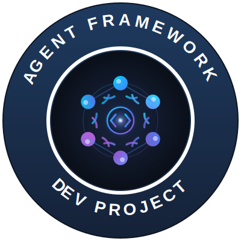
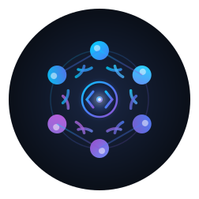

# Agent Frameword Dev Project - brand assets

## Identity

This is the "Agent Framework Dev Project" overall.

This project is hosting some "Agent Framework Dev Day" events and producing associated assets (labs, decks, etc.).

## Logo

Of course our logo is AI-generated. Upgrade to one made by Claude in Jan 2026.

### Full Logo

The full logo can be used where space is available and maximum brand clarity is most valuable.

### Inner Logo

The smaller "inner" logo can be used for favicons and some other tighter scanarios.

### Background

I asked Claude for something _focused on "community" abstractly since this is a community effort about sharing, coding, developers, AI agents, and collaboration_.

If offered the above two logos (though I tweaked the text one) and included the following narrative explaining the design choices.

### Narrative (Quoting Claude)

I love that direction - community, collaboration, developers coming together. Let me create something that captures that spirit abstractly.

Here's the **Community** concept:

**The Design:**

- **Six abstract developer figures** arranged in a circle - each with a head, body, and arms reaching outward to connect with neighbors
- **Each figure has a unique color** along the cyan-to-purple spectrum, representing diversity in the community
- **Arms reaching toward neighbors** symbolize collaboration and connection between developers
- **Hexagonal connection lines** between figures show the network of relationships
- **Central hub with code brackets `< >`** represents the shared codebase/project everyone contributes to
- **Glowing center dot** represents the AI agent at the heart of the project

**What it communicates:**

- Developers coming together around a shared mission
- Collaboration and open contribution
- Code/development focus (the brackets)
- AI agents at the center of the effort
- Community diversity (the gradient colors across figures)
- Everyone connected, everyone contributing

**Files included:**

- Full logo (SVG + 512px PNG)
- Favicon/inner (SVG + PNGs at 256, 128, 64, 32, and 16px)

The figures remain recognizable even at small sizes, though they become more abstract - which works well for a favicon. Let me know if you'd like to adjust the number of figures, their poses, the central element, or any other aspect!
